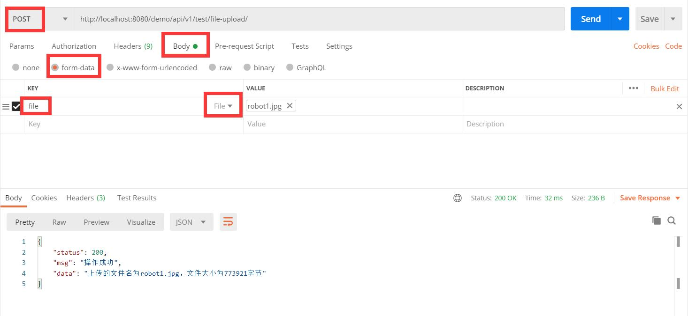
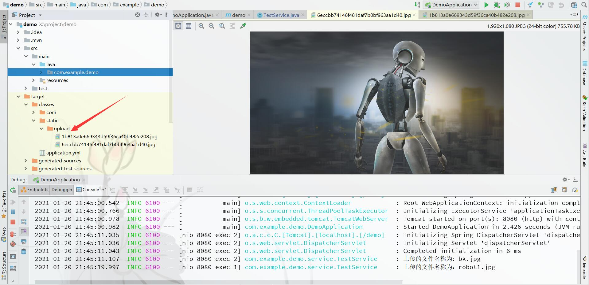

# SpringBoot演示Demo
## 启动
- IDEA运行com.example.demo.DemoApplication类
- 服务启动之后，控制台输出：“Tomcat started on port(s): 8080 (http) with context path '/demo'”
## 回音壁测试接口（将请求中的参数返回）
- 测试GET请求，浏览器访问：http://localhost:8080/demo/api/v1/test/ping/?param=helloworld
## 文件上传测试
- 测试文件上传，下载postman，上传文件

- 在编译路径下查看上传的文件
